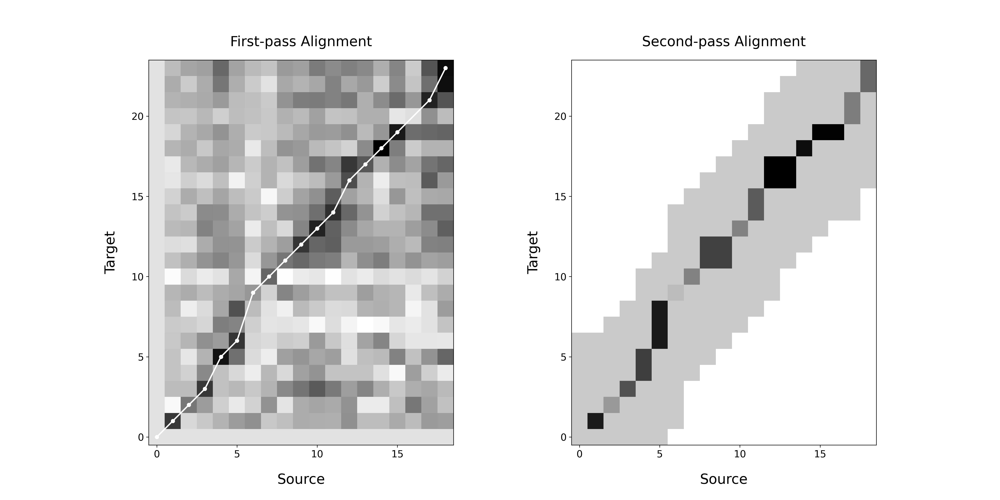

# Evaluation of Automatic Sentence Aligners

This repository consists of the datasets and Python scripts for the evaluation of automatic sentence aligners.

#### You can install AlignerEval and conduct the evaluation directly in a [Google Colab notebook](https://colab.research.google.com/drive/1qSpultu_DS1_bx4EV5a4XAcON61qlBO7#scrollTo=otUWfH7D-o6X).

## Systems Evaluated

Table 1 shows the sentence aligners being evaluated,  where S and T means source and target text respectively, T<sub>d</sub> is the translation of source text using bilingual lexicons and T<sub>m</sub> is the machine translation of source text. S<sub>e</sub> and T<sub>e</sub> are vector representations of source and target texts using sentence embedding techniques such as [LASER](https://github.com/facebookresearch/LASER) and [sentence-transformers](https://github.com/UKPLab/sentence-transformers).

##### Table 1. Systems evaluated and implementation details

| System                                                | Type             | Input                           |
| ----------------------------------------------------- | ---------------- | ------------------------------- |
| [Galechurch](https://aclanthology.org/J93-1004/)      | Length-based     | S <=> T                         |
| [Hunalign](http://mokk.bme.hu/en/resources/hunalign/) | Dictionary-based | T<sub>d</sub> <=> T             |
| [Bleualign](https://github.com/rsennrich/Bleualign)   | MT-based         | T<sub>m</sub> <=> T             |
| [Bleurtalign](./bin/bleualign/bleualign/align_bleurt.py)   | MT-based         | T<sub>m</sub> <=> T             |
| [Vecalign](https://github.com/thompsonb/vecalign)     | Embedding-based  | S<sub>e</sub> <=> T<sub>e</sub> |
| [Bertalign](https://github.com/bfsujason/bertalign)   | Embedding-based  | S<sub>e</sub> <=> T<sub>e</sub> |

## Evaluation Corpora

Both literary and non-literary corpora are used to evaluate the performance of available sentence aligners.

We use the script [stats.py](./utils/stats.py) to compute the corpus statistics:

```bash
python utils/stats.py -i data/mac -o ./stats
```

#### Literary Corpora

###### Table 2. Summary of Literary Corpora

| Corpus | Src_Lang | Tgt_Lang | # Src_Sents | # Tgt_Sents | # Src_Tokens | # Tgt_Tokens | # 1-1 (%)  |
| ------ | ------- | ------- | ---------- | ---------- | ---------- | ---------- | ---------- |
| MAC-Test    | Chinese | English | 4,799      | 5,573      | 73,635      | 105,407     | 2,628 (59.8) |
| Bible  | English | Chinese | 30,000     | 42,687     |  714,048      | 524,340     | 15,665 (56.6) |

##### MAC

[The MAC corpus](./data/mac) is a manually aligned corpus of Chinese-English literary texts. The sampling scheme for the corpus can be found at [the metadata](./data/mac/meta_data.xlsx). Please refer to [the Github repository](https://github.com/bfsujason/mapc) for more details about corpus compilation.

The [gold alignments](./data/mac/gold) are created manually using [Intertext](./data/mac/intertext) and then converted to [source](./data/mac/src) and [target](./data/mac/tgt) texts using the script [intertext2txt.py](./utils/intertext2txt.py).

The [source](./data/mac/src) and [target](./data/mac/tgt) directories contain the sentence-split and tokenized source texts, target texts and the machine translations of source texts - Hunalign requires tokenized sentences for dictionary search while Bleualign uses MT translations to compute the BLEU similarity scores between source and target sentences.

We use [Moses sentence splitter](https://github.com/moses-smt/mosesdecoder/blob/master/scripts/ems/support/split-sentences.perl) and [Stanford CoreNLP](https://stanfordnlp.github.io/CoreNLP/usage.html) English sentence splitting and tokenization, while [pyltp](https://github.com/HIT-SCIR/pyltp) and [jieba](https://github.com/fxsjy/jieba) are used to split and tokenize Chinese sentences. The MT of source texts are generated by [Google Translate](https://translate.google.cn/).

##### Bible

[The Bible corpus](./data/bible), consisting of 30,000 English and 42,687 Chinese sentences, is selected from the public [multilingual Bible corpus](https://github.com/christos-c/bible-corpus/tree/master/bibles). This corpus is mainly used to compare the running time of various aligners.

The directory makeup is similar to Fiction corpus, except that the gold alignments for the Bible corpus are generated automatically from the original verse-aligned Bible corpus.

In order to compare the sentence-based alignments returned by various aligners with the verse-based gold alignments, we put the verse ID for each sentence in the files *src.verse* and *zh.verse* which are used to merge consecutive sentences in the automatic alignments if they belong to the same verse.

#### Non-literary Corpora

###### Table 3. Summary of Non-literary Corpora

| Corpus            | Src_Lang | Tgt_Lang | # Src_Sents | # Tgt_Sents | # Src_Tokens | # Tgt_Tokens | # 1-1 (%)  |
| ----------------- | ------- | ------- | ---------- | ---------- | ------- | ---------- | ---------- |
| Academic Texts    | English | Chinese | 1,126      | 1,111      | 26,022      | 24,401     | 965 (90.8) |
| Political Texts   | Chinese | English | 1,037      | 1,346      | 23,929      | 34,075     | 770 (75.6) |
| Magazine Articles | English | Chinese | 1,027      | 1,128      | 18,323      | 18,838     | 891 (88.3) |

The Non-literary corpora is made up of three sub-corpus:

- [The corpus of academic texts](./data/aca) consists of 13 English academic texts and their translations from the category of learned texts in [Yiyan English-Chinese Parallel Corpus](http://corpus.bfsu.edu.cn/info/1070/1631.htm). 

- [The corpus of political texts](./data/pol) is made up of 19 speeches and writings from the book [Xijinping: The Governance of China Volume 1](https://www.amazon.cn/dp/B07F1HL638).

- [The corpus of magazine articles](./data/mag) is sampled from [the Babel English-Chinese Parallel Corpus](https://www.lancaster.ac.uk/fass/projects/corpus/babel/babel.htm), containing 27 English articles from the Time Magazine and their Chinese translations. 

For all of the corpora above, the original bitexts were firstly split into sentences and then checked or aligned manually using the alignment tool [Intertext](./data/aca/intertext). Please refer to [the metadata of academic texts](./data/aca/meta_data.xlsx), [political texts](./data/pol/meta_data.xlsx) and [magazine articles](./data/mag/meta_data.xlsx) for the specific titles of selected source and target texts.

## Experiments on MAC corpus

The following experiments show evaluation results on MAC corpus with BLEU metric and LaBSE embeddings. For results on other datasets with different [BLEURT](https://github.com/google-research/bleurt) metrics and LASER embeddings, please refer to [the Google Colab notebook](https://colab.research.google.com/drive/1qSpultu_DS1_bx4EV5a4XAcON61qlBO7#scrollTo=otUWfH7D-o6X). 

#### Installation

```bash
# Install faiss-gpu.
pip install faiss-gpu

# Install sentence-transformers.
pip install sentence-transformers
```

#### Embedding

```bash
# Generate source sentence embeddings.
python utils/overlap.py \
  -i data/mac/src \
  -o data/mac/src/overlap \
  -n 8

python utils/embed.py \
  -i data/mac/src/overlap \
  -o data/mac/src/overlap.labse.emb
```

```bash
# Generate target sentence embeddingss.
python utils/overlap.py \
  -i data/mac/tgt \
  -o data/mac/tgt/overlap \
  -n 8

python utils/embed.py \
  -i data/mac/tgt/overlap \
  -o data/mac/tgt/overlap.labse.emb
```

#### Evaluation

```bash
# GaleChurch: length-based aligner.
python bin/gale_align.py \
  -s data/mac/src \
  -t data/mac/tgt \
  -o data/mac/auto

python utils/eval.py \
  -t data/mac/auto \
  -g data/mac/gold
```

```bash
# Hunalign: Dictionary-based aligner.
python bin/hunalign/hunalign.py \
  -s data/mac/src \
  -t data/mac/tgt \
  -o data/mac/auto \
  -m data/mac/meta_data.tsv

python utils/eval.py \
  -t data/mac/auto \
  -g data/mac/gold
```

```bash
# Bleualign: MT-based aligner using BLEU metric.
python bin/bleualign/bleualign.py \
  -s data/mac/src \
  -t data/mac/tgt \
  -o data/mac/auto \
  -m data/mac/meta_data.tsv

python utils/eval.py \
  -t data/mac/auto \
  -g data/mac/gold
```

```bash
# Bleualign: MT-based aligner using BLEURT metric.
python bin/bleualign/bleualign.py \
  -s data/mac/src \
  -t data/mac/tgt \
  -o data/mac/auto \
  -m data/mac/meta_data.tsv \
  --bleurt /content/bleurt/BLEURT-20-D6

python utils/eval.py \
  -t data/mac/auto \
  -g data/mac/gold
```

```bash
# Vecalign with LaBSE embeddings.

python bin/vecalign/vecalign.py \
 -s data/mac/src \
 -t data/mac/tgt \
 -o data/mac/auto \
 -m labse -a 8 -v 
python utils/eval.py \
 -t data/mac/auto \
 -g data/mac/gold
```

```bash
# Bertalign with LaBSE embeddings.
python bin/bertalign/bert_align.py \
  -s data/mac/src \
  -t data/mac/tgt \
  -o data/mac/auto \
  -m labse --max_align=8 --margin

python utils/eval.py \
  -t data/mac/auto \
  -g data/mac/gold
```

#### Results

| Systems            | Precision | Recall | F<sub>1</sub> |
| ------------------ | --------- | ------ | ------------- |
| Gale-Church        | 0.442     | 0.470  | 0.455         |
| Hunalign           | 0.566     | 0.656  | 0.607         |
| Bleualign (bleu)   | 0.711     | 0.644  | 0.671         |
| Bleualign (bleurt) | 0.718     | 0.706  | 0.712         |
| Vecalign           | 0.860     | 0.886  | 0.873         |
| Bertalign          | 0.906     | 0.912  | 0.909         |

#### Visualization

You can run the Python script [demo_vis.py](./bin/bertalign/demo_vis.py) for visualization of the Bertalign's two-step algorithm using Mathplotlib:

```
python bin/bertalign/demo_vis.py \
   -s data/demo/demo.zh \
   -t data/demo/demo.en \
   --max_align=8 --margin
```



In the first-pass alignment, Bertalign finds the 1-1 links for approximate anchor points. The second-pass alignment limits the search path to the anchor points and extracts all the valid alignments with 1-to-many, many-to-1 or many-to-many relations between the source and target sentences.
